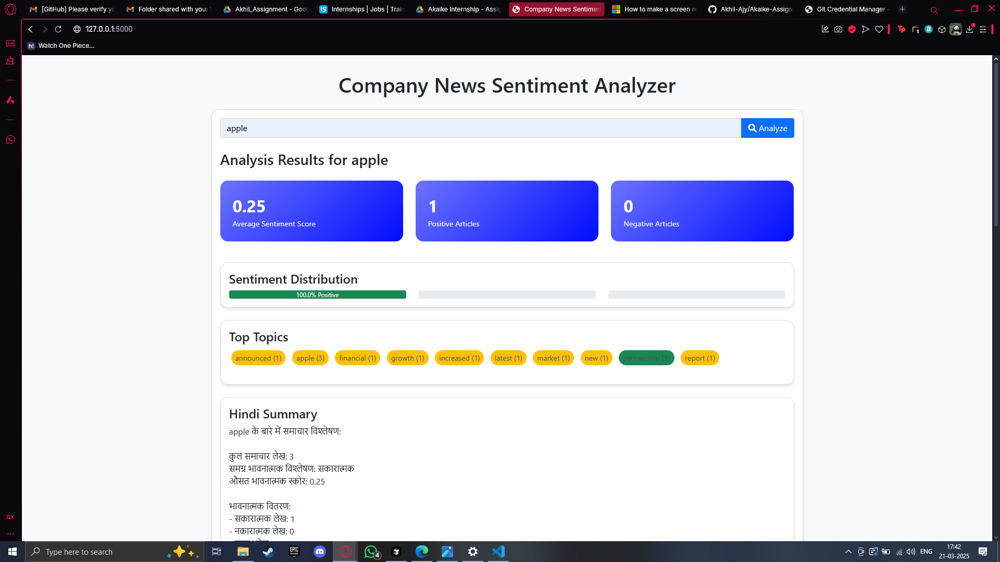
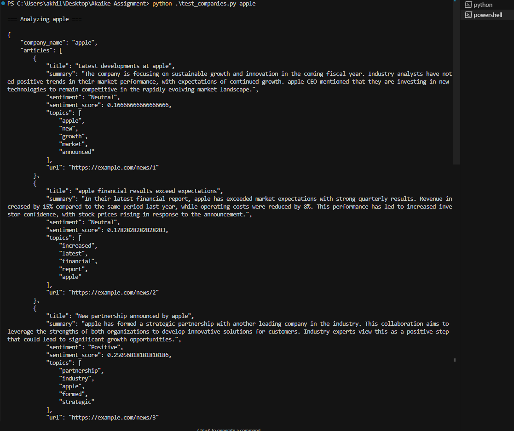

# Company News Sentiment Analyzer

A web-based application that analyzes news articles related to a given company, performs sentiment analysis, and generates a Hindi text-to-speech summary.

## Features

- Fetches 10 recent news articles about a specified company using web scraping
- Performs sentiment analysis on article titles and content
- Conducts comparative analysis across articles
- Generates a Hindi summary of the analysis
- Provides text-to-speech output in Hindi
- Displays detailed sentiment analysis with visualizations
- Modern, responsive web interface with interactive charts

## Prerequisites

- Python 3.7 or higher
- Internet connection for web scraping

## Installation

1. Clone the repository:
```bash
git clone <repository-url>
cd company-news-analyzer
```

2. Create a virtual environment and activate it:
```bash
python -m venv venv
source venv/bin/activate  # On Windows: venv\Scripts\activate
```

3. Install the required packages:
```bash
pip install -r requirements.txt
```

## Usage

1. Start the Flask application:
```bash
python app.py
```

2. Open your web browser and navigate to `http://localhost:5000`

3. Enter a company name in the search box and click "Analyze"

4. View the results, including:
   - Sentiment statistics and distribution
   - Interactive sentiment chart
   - Hindi summary of the analysis
   - Audio playback of the Hindi summary
   - Detailed sentiment analysis for each article
   - Links to original articles

## Deployment on Hugging Face Spaces

1. Create a new Space on Hugging Face:
   - Go to huggingface.co
   - Click "New Space"
   - Choose "Flask" as the SDK
   - Name your space

2. Create a `requirements.txt` file in your Space with the following content:
```
flask==2.0.1
requests==2.26.0
beautifulsoup4==4.9.3
nltk==3.6.3
gTTS==2.3.1
python-dotenv==0.19.0
textblob==0.15.3
pandas==1.3.3
numpy==1.21.2
```

3. Create a `app.py` file in your Space with the provided code

4. Create a `templates` folder and add the `index.html` file

5. Create a `.gitignore` file:
```
__pycache__/
*.pyc
venv/
.env
*.mp3
```

6. Push your code to the Space:
```bash
git add .
git commit -m "Initial commit"
git push
```

## Technologies Used

- Flask (Python web framework)
- BeautifulSoup4 (Web scraping)
- TextBlob (Sentiment analysis)
- gTTS (Text-to-speech conversion)
- Chart.js (Data visualization)
- Bootstrap 5 (Frontend styling)
- JavaScript (Frontend interactivity)

## Implementation Details

### News Extraction
- Uses BeautifulSoup to scrape news articles from Google News
- Extracts title, content, source, and publication date
- Filters out JavaScript links and invalid URLs
- Handles various website structures and formats

### Sentiment Analysis
- Analyzes both article titles and content
- Uses TextBlob for sentiment scoring
- Combines title and content sentiment for better accuracy
- Categorizes sentiment as positive, negative, or neutral

### Comparative Analysis
- Calculates average sentiment across articles
- Computes sentiment distribution
- Identifies trends in news coverage
- Provides statistical insights

### Text-to-Speech
- Generates Hindi summaries using gTTS
- Includes sentiment statistics and key points
- Creates temporary audio files for playback
- Handles Hindi text encoding properly

## Notes

- The application fetches news articles from Google News
- Sentiment analysis is performed on both article titles and content
- The Hindi summary includes overall sentiment, distribution, and key points
- Audio files are generated temporarily and served through the application
- The interface includes interactive charts and statistics
- All communication between frontend and backend happens via REST APIs 




